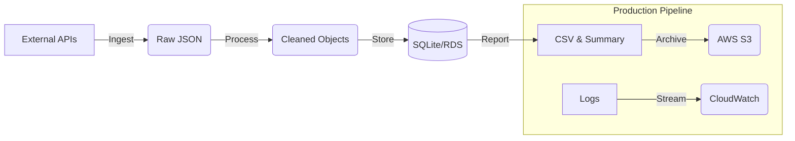

# Internal Data Automation

**A production-grade ETL pipeline for financial market data ingestion, processing, and reporting.**

---

## 📖 About

The **Internal Data Automation** system is a robust Python-based pipeline designed to automate the daily workflow of validatng, ingesting, cleaning, and storing financial data. It is built with a focus on reliability, observability, and security, making it suitable for enterprise-grade deployment on AWS.

## ✨ Key Features

- **🛡️ Production-Ready**: Enforces strict validation, immutable infrastructure patterns, and fail-safe execution.
- **🐳 Containerized**: Fully dockerized application ensuring consistency across Dev, Test, and Prod environments.
- **☁️ Cloud-Native**:
  - **S3 Integration**: Automated archiving of reports and raw data.
  - **CloudWatch Logs**: Real-time log streaming for production auditing.
- **🔄 Automated**: Includes scripts for idempotent execution and Cron scheduling.
- **🔒 Secure**: Zero-trust credential management via environment variables.

## 🚀 Quick Start

### Prerequisites
- Docker & Docker Compose
- Python 3.11+ (for local development)
- AWS Account (for production features)

### 1. Configuration
Create a `.env` file in the root directory:
```bash
ALPHA_VANTAGE_API_KEY="your_key"
NEWS_API_KEY="your_key"
```

### 2. Run with Docker (Recommended)
Build and run the container in one go:

```bash
# Build
docker build -t internal-data-automation .

# Run (Mounts local volumes for data persistence)
docker run --rm \
  --env-file .env \
  -v "$(pwd)/data:/app/data" \
  -v "$(pwd)/reports:/app/reports" \
  -v "$(pwd)/logs:/app/logs" \
  internal-data-automation
```

### 3. Run Locally
```bash
pip install -r requirements.txt
python run_pipeline.py
```

## 🏗️ Architecture



## 📂 Project Structure

```text
├── config.yaml             # App configuration (timeouts, paths)
├── deployment_guide.md     # 📘 AWS EC2 Deployment Guide
├── scheduling.md           # ⏲️ Cron Scheduling Guide
├── Dockerfile              # Production Docker image definition
├── run_pipeline.py         # Main execution entry point
├── scripts/                # Operational scripts (e.g., cron wrappers)
└── internal_data_automation/
    ├── ingestion/          # API Clients with retry logic
    ├── processing/         # Data cleaning & normalization
    ├── storage/            # Database abstraction
    └── reporting/          # Report generation logic
```

## 📚 Documentation

- **[Deployment Guide](deployment_guide.md)**: Step-by-step instructions for deploying to AWS EC2.
- **[Scheduling Guide](scheduling.md)**: How to set up automated daily runs.

---

