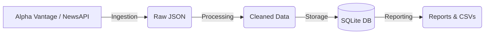

# Internal Data Automation

## Overview
The **Internal Data Automation** project is a comprehensive ETL (Extract, Transform, Load) pipeline designed to ingest, process, store, and report on financial market data and related news. It automates the daily workflow of fetching data from external APIs (Alpha Vantage, NewsAPI), cleaning it for analysis, persisting it in a local database, and generating daily summaries.

## Architecture
The pipeline consists of four distinct stages:

1.  **Ingestion**: Fetches raw JSON data from external providers.
2.  **Processing**: Cleanses, normalizes, and extracts relevant fields from the raw data.
3.  **Storage**: Persists the structured data into a SQLite database.
4.  **Reporting**: Generates summary text reports and CSV exports of the collected data.



## Folder Structure
```text
internal-data-automation/
├── config.yaml             # Configuration and API keys
├── requirements.txt        # Python dependencies
├── run_pipeline.py         # Main entry point (CLI)
├── reports/                # Generated reports
├── logs/                   # Pipeline execution logs
├── data/
│   ├── raw/                # Raw API responses
│   └── internal_data.db    # SQLite database
└── internal_data_automation/
    ├── ingestion/          # Data fetching modules
    ├── processing/         # Data cleaning modules
    ├── storage/            # Database operations
    └── reporting/          # Report generation
```

## Setup Instructions

1.  **Prerequisites**: Python 3.8+ installed.
2.  **Clone the Repository**:
    ```bash
    git clone <repository-url>
    cd internal-data-automation
    ```
3.  **Install Dependencies**:
    ```bash
    pip install -r requirements.txt
    ```

## Configuration
Edit `config.yaml` to include your API keys:

```yaml
alpha_vantage:
  api_key: "YOUR_ACTUAL_API_KEY"
  
news_api:
  api_key: "YOUR_ACTUAL_API_KEY"
```

## Usage

The pipeline is executed via `run_pipeline.py`. It supports command-line arguments for flexibility.

### Standard Run (Daily Sync)
Runs the full pipeline for the current date.
```bash
python run_pipeline.py
```

### Run for a Specific Date
Fetches and processes data for a historical date.
```bash
python run_pipeline.py --date 2026-02-01
```

### Partial Runs
You can skip specific stages using flags:
```bash
# Skip ingestion (e.g., if re-processing existing raw data)
python run_pipeline.py --skip-ingestion

# Skip reporting (e.g., just ingesting and storing)
python run_pipeline.py --skip-reporting
```

Available flags:
- `--skip-ingestion`
- `--skip-processing`
- `--skip-storage`
- `--skip-reporting`

## Outputs
- **Logs**: `logs/pipeline.log` contains detailed execution logs.
- **Reports**: 
  - `reports/summary_{date}.txt`: Daily summary of records processed.
  - `reports/market_data_{date}.csv`: Export of market data.

## Future Improvements
- Add email notifications for report delivery.
- Migrate storage to PostgreSQL for scale.
- Implement dashboarding (e.g., Streamlit) on top of the database.
